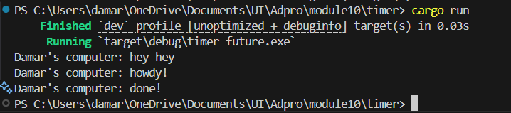
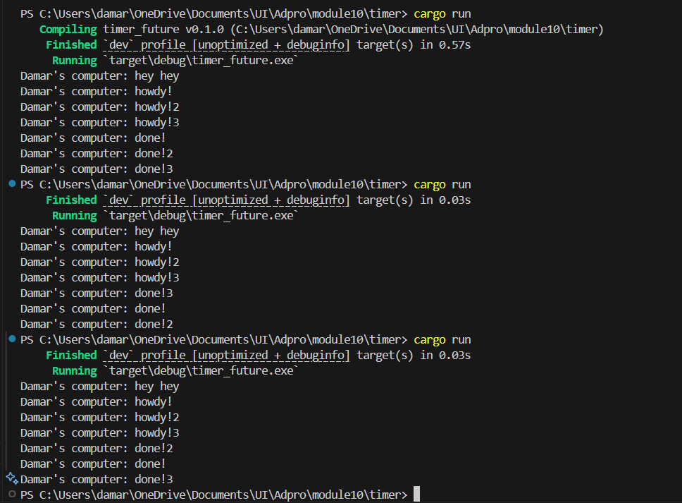
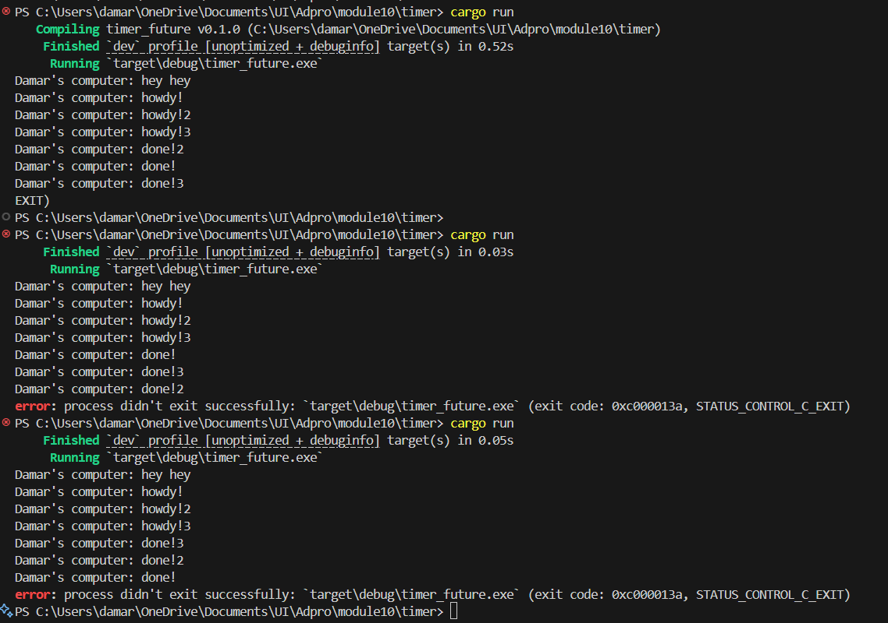

# 1.2. Understanding how it works.

When you call println!("hey hey"), it executes right away on the main thread—no futures have been driven yet. Invoking spawner.spawn(...) merely places the async block into the executor’s work queue; it doesn’t start running its contents immediately. Once you call executor.run(), the executor pulls that task off the queue and polls it for the first time, which triggers the "howdy!" print. The timer inside then returns Poll::Pending, so the task is re-queued. Two seconds later, the timer’s background thread uses the stored waker to wake the task; when executor.run() polls it again, you see "done!" printed.

### Removing drop(spawner);

The three “howdy!” messages always show up in the precise order of 1, 2, and 3 because each async block is polled right away and prints as soon as it's started. In contrast, the “done!” messages come from separate timer threads that each wait for two seconds before waking their respective tasks. Since these timers operate independently, their completion messages appear in a random order. Also, since the spawner is never dropped, the executor’s loop keeps waiting for new tasks indefinitely, as it never detects the channel closing—meaning you have to manually stop the program.

### With drop(spawner);

The three “howdy!” messages always appear in the same order you created the tasks because each async block is polled right away and prints immediately, one after another. In contrast, the “done!” messages come from separate timer threads that each sleep for two seconds. Since each timer wakes up at its own pace, they trigger their wakers at different times, causing the “done!” messages to print in a random, unpredictable order.